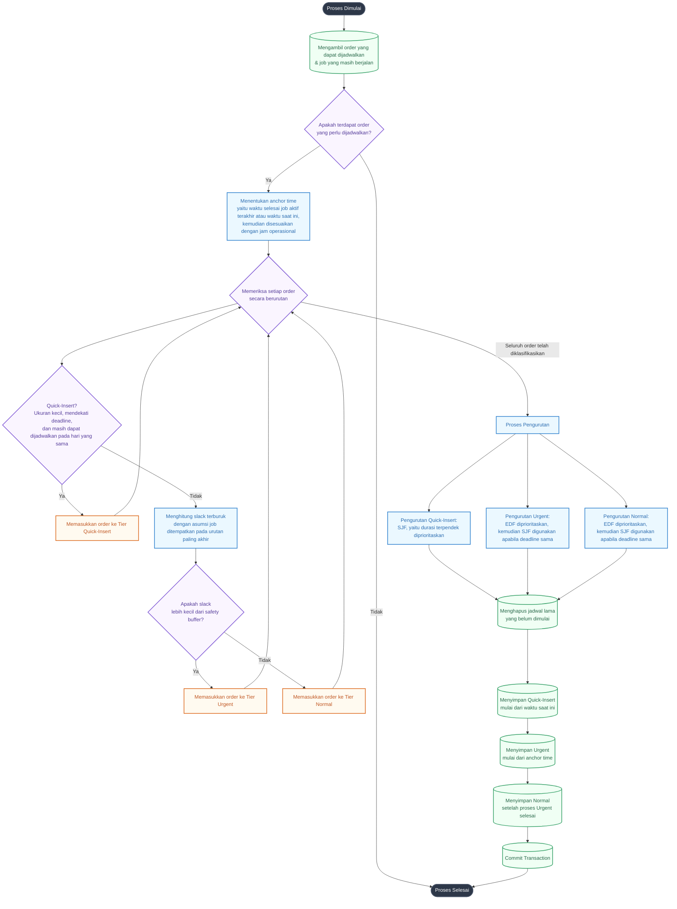

# Alur Penyusunan Jadwal Produksi

Flowchart ini menjelaskan tahapan logika yang digunakan oleh algoritma penjadwalan pada `M_schedule::generate()`.

### Penjelasan Singkat

1. **Anchor Time**  
   Anchor time digunakan untuk menjaga kesinambungan proses produksi. Apabila masih terdapat job yang sedang berjalan, maka penyusunan jadwal baru mengikuti perkiraan waktu selesai job tersebut.

2. **Quick-Insert**  
   Order dimasukkan ke kategori ini apabila ukuran pekerjaan relatif kecil, memiliki deadline yang dekat, dan masih tersedia slot waktu pada hari yang sama.

3. **Analisis Slack Terburuk**  
   Sistem menghitung kondisi slack dengan asumsi bahwa job ditempatkan pada urutan paling akhir. Apabila nilai slack lebih kecil dari safety buffer, order tersebut dikategorikan sebagai **Urgent**. Jika masih aman, order dimasukkan ke **Normal**.

4. **Sorting EDF dan SJF**  
   Setelah klasifikasi selesai, setiap kategori diurutkan kembali. Metode **EDF (Earliest Deadline First)** digunakan untuk memprioritaskan deadline terdekat, sedangkan **SJF (Shortest Job First)** digunakan sebagai urutan tambahan apabila terdapat deadline yang sama.

### Inti Logika
- Order dengan ukuran kecil dan tingkat urgensi tinggi dapat langsung dimasukkan ke kategori **Quick-Insert**.
- Order dengan risiko keterlambatan yang tinggi masuk ke kategori **Urgent**.
- Order yang masih memiliki tingkat keamanan waktu yang baik masuk ke kategori **Normal**.
- Seluruh order kemudian diurutkan kembali sebelum disimpan ke database.
