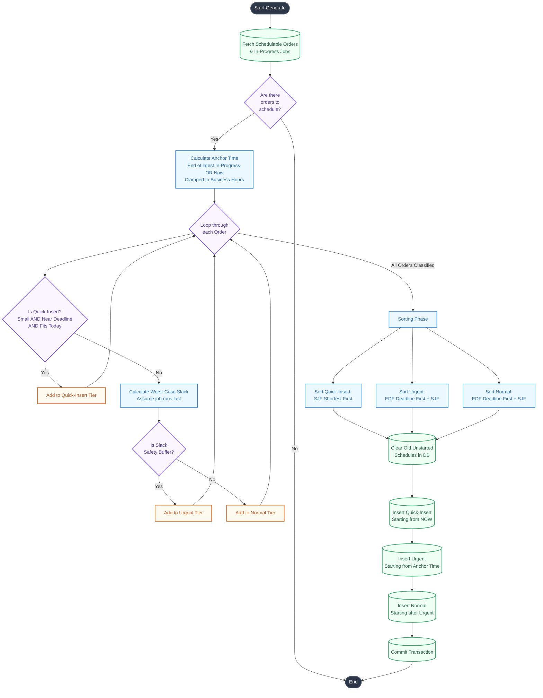

# Production Schedule Generation Flowchart

This flowchart details the step-by-step logical process of how the scheduling algorithm in `M_schedule::generate()` works.

### Explanatory Notes
1. **Anchor Time**: This ensures the continuous flow of production. If a job is currently running, the schedule builds off its projected completion time.
2. **Quick-Insert**: This bypasses the normal queue entirely, slotting right into today's timeline if there's an operational gap.
3. **Worst-Case Slack Analysis**: The algorithm mathematically forces a task to the end of the line, calculates its projected end date, and checks if it misses the deadline. If it does (or gets dangerously close based on the safety buffer), it gets promoted to Urgent.
4. **EDF + SJF Sorting**: The recent fix ensures that if multiple jobs land on the exact same deadline, the algorithm resolves the tie by processing the shortest job first (SJF), thereby clearing the backlog faster.
